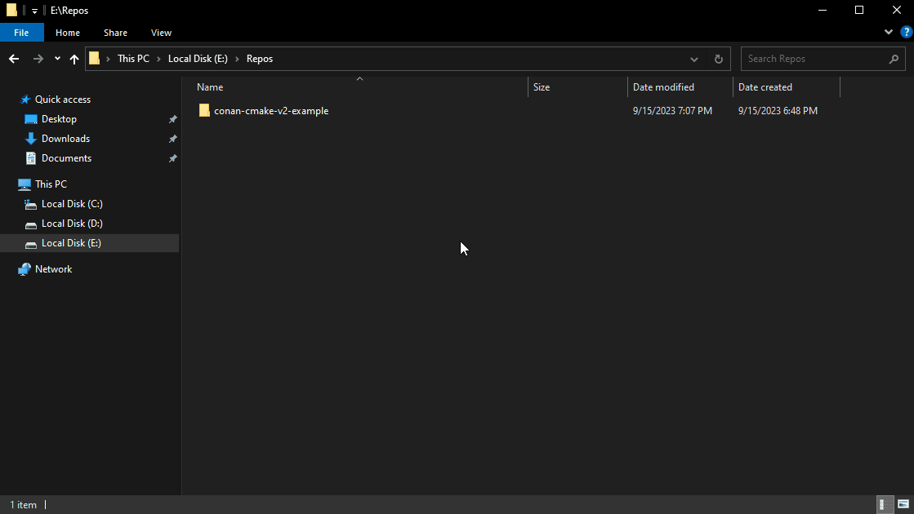

# cmake-conan v2 与 CMakePresets.json 示例

引用 [cmake-conan develop2](https://github.com/conan-io/cmake-conan/blob/develop2/conan_provider.cmake) 分支针对 conan 2.0 版本的跨平台项目自动化 cmake 脚本示例，配合 CMakePresets.json 效果演示。

## 效果演示

### Visual Studio Code


### Visual Studio IDE



### Qt Creator


## 手动编译

查看支持编译的目标

```bash
➜  conan-cmake-v2-example git:(main) ✗ cmake --list-presets
Available configure presets:

  "darwin-debug"                - Darwin 10.14+ (Debug)
  "darwin-release-arm64"        - Darwin arm64 10.14+ (Release)
  "darwin-release-x86_64"       - Darwin x86_64 10.14+ (Release)
  "ios-release-arm64"           - iOS arm64 9.0+ (Release)
  "ios-release-armv7"           - iOS armv7 9.0+ (Release)
  "ios-release-x86_64"          - iOS x86_64 9.0+ (Release)
  "android-release-x86_64"      - Android x86_64 abi21 (Release)
  "android-release-x86"         - Android x86 abi21 (Release)
  "android-release-armeabi-v7a" - Android armeabi-v7a abi21 (Release)
  "android-release-arm64-v8a"   - Android arm64-v8a abi21 (Release)
```

编译 Android arm64-v8a 示例：

```bash
cmake --preset android-release-arm64-v8a
cmake --build --preset android-release-arm64-v8a
```
